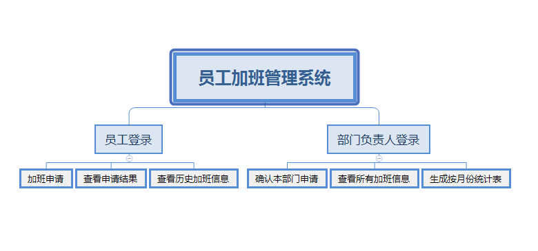
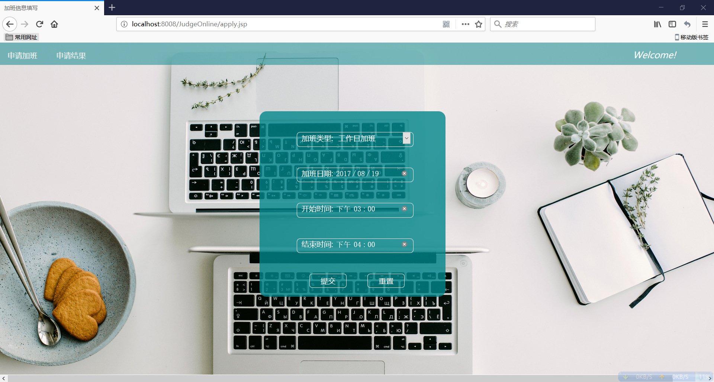
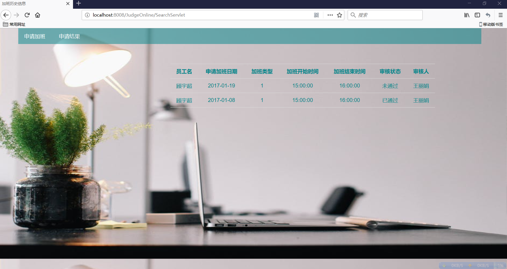
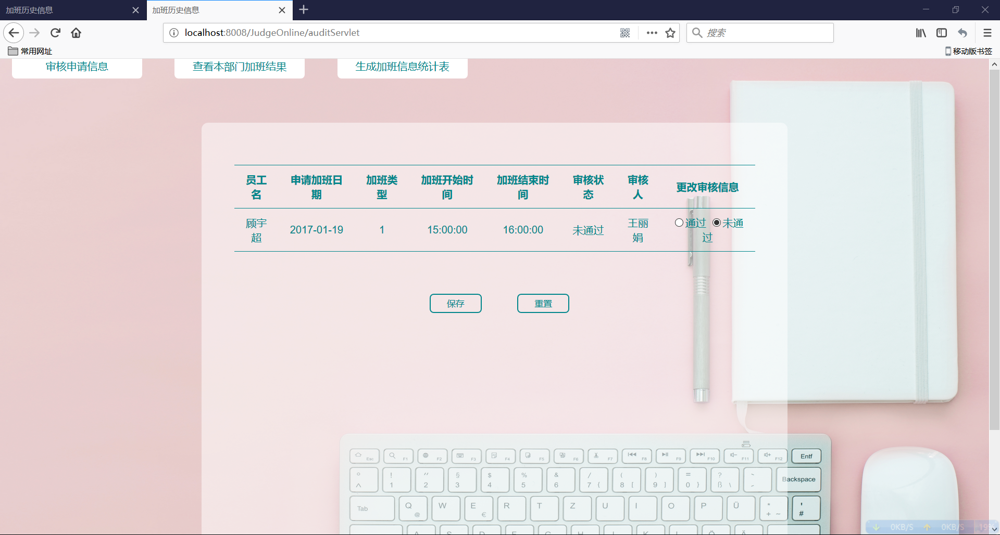
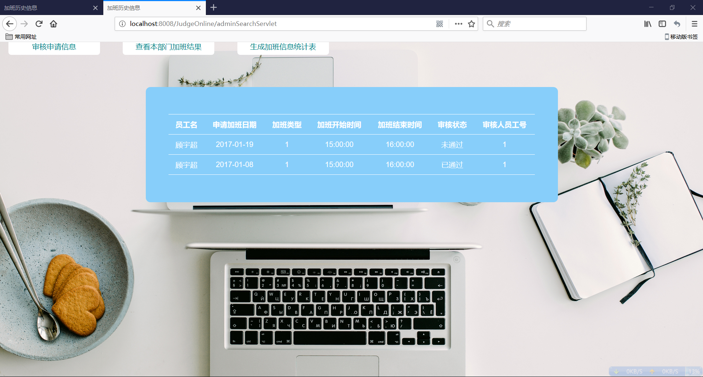
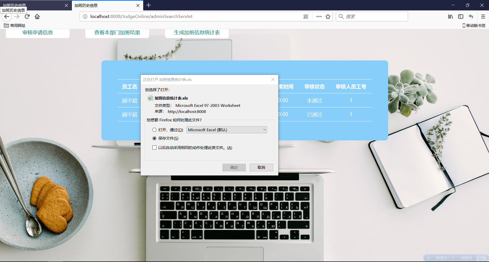
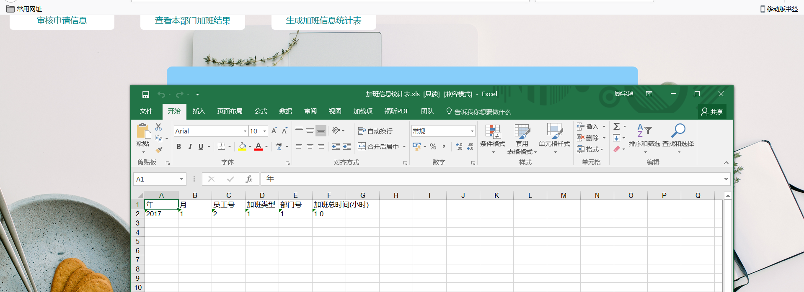

# Database-Project
> Author: Yuchao Gu

> E-mail: 2015014178@buct.edu.cn

> Date: 2017-12-27

>Description: 北京化工大学15级数据库课程设计，我抽到的题目为员工加班管理，采用jsp前端页面展示，sevelet后台服务，实现的是B/S架构

## 功能概览

### 整体一览

### 员工部分

分为申请页，查询申请结果页

### 负责人部分

分为主页，审核页，查看历史页

### 生成excel月报表

## 环境

* 系统支持：`windows` 

* 编程环境:`eclipse`
